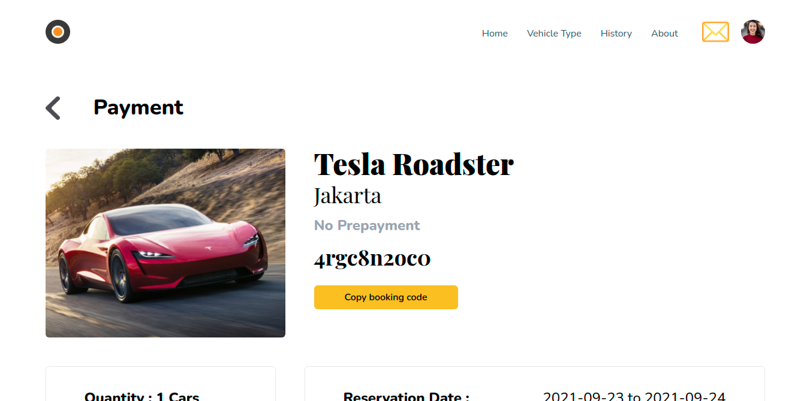

<!-- PROJECT LOGO -->
<br />
<p align="center">
  <a href="https://github.com/19damah23/vehicle-rental">
    
  </a>

  <h3 align="center">Vehicle Rental</h3>

  <p align="center">
    Vehicle rental is a application that will make it easier for us when we need vehicle rental services. We can determine the date and there are several ways of payment that will be very easy.
    <br />
    <a href="https://github.com/19damah23/vehicle-rental"><strong>Explore the docs »</strong></a>
    <br />
    <br />
    <a href="https://vehicle-rental.muchamadagushermawan.online/">View Demo</a>
    ·
    <a href="https://github.com/19damah23/vehicle-rental">Report Bug</a>
    ·
    <a href="https://github.com/19damah23/vehicle-rental">Request Feature</a>
  </p>
</p>

<!-- TABLE OF CONTENTS -->
<details open="open">
  <summary>Table of Contents</summary>
  <ol>
    <li>
      <a href="#about-the-project">About The Project</a>
        <ol>
            <li>
                <a href="#build-with">Build With</a>
            </li>
        </ol>
    </li>
    <li>
      <a href="#getting-started">Getting Started</a>
      <ol>
        <li>
          <a href="#installation">Installation</a>
        </li>
        <li>
          <a href="#prerequisites">Prerequisites</a>
        </li>
        <li>
          <a href="#related-project">Related Project</a>
        </li>
      </ol>
    </li>
    <li><a href="#screenshots">Screenshots</a></li>
    <li><a href="#contact">Contact</a></li>
  </ol>
</details>

## About The Project

<b>Vehicle rental</b> is a.

### Build With
* [JavaScript](https://www.javascript.com/)
* [Next Js](https://nextjs.org/)


## Getting Started

### Prerequisites

This is an example of how to list things you need to use the software and how to install them.
* [Node Js](https://nodejs.org/en/download/)

### Installation

1. Clone These 2 Repos (Backend and Frontend)
```sh
git clone https://github.com/19damah23/vehicle-rental
```
2. Go To Folder Repo
```sh
cd vehicle-rental
```
3. Install Module
```sh
npm install
```
4. Add .env file at root folder project, and add following
```sh
NEXT_PUBLIC_VERCEL_ENV = [BACKEND_API]
```
5. Start website
```sh
npm run dev
```

### Related Project
* [`Frontend Vehicle Rental`](https://github.com/19damah23/vehicle-rental)
* [`Backend Vehicle Rental`](https://github.com/19damah23/Backend-rental)

## Screenshots

<div align="center">
       
    
</div>
<div align="center">
       
    
</div>
<div align="center">
       
    
</div>
<div align="center">
       
    
</div>

## Contact
My Email : muchamadagush@gmail.com

Project Link: [https://github.com/19damah23/vehicle-rental](https://github.com/19damah23/vehicle-rental)